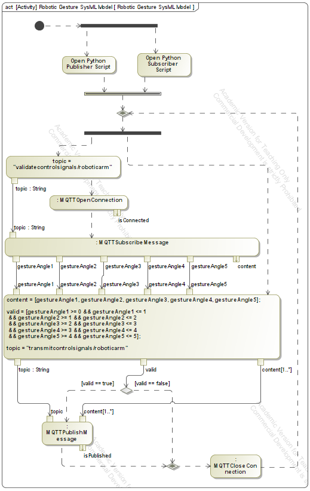
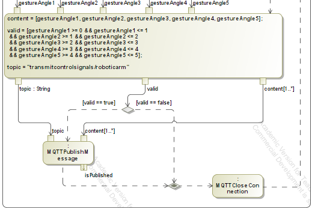
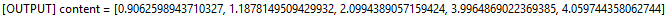
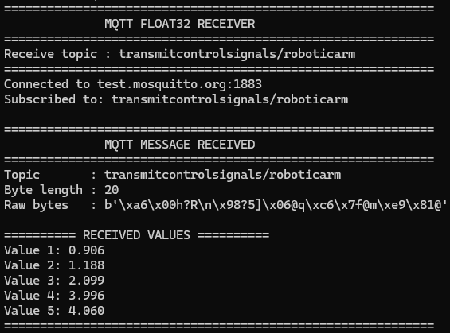

# Week 4 Report: Software-in-the-Loop (SIL) Validation
*SysML Model Communication, MQTT Protocol Facilitation & Signal Range Validation*

---

## 1. System Architecture & MQTT Facilitation (Task 1)

The Phase 1 Software-in-the-Loop (SIL) simulation establishes two-way communication between a Python control signal publisher, a SysML Model representing the System of Interest (SoI), and a Python receiving subscriber. Facilitated by the public broker `test.mosquitto.org:1883`, the SysML SoI subscribes to 20-byte payloads (five Float32 joint angles) on topic `validatecontrolsignals/roboticarm`, validates angles against tolerance bands, and publishes approved signals on topic `transmitcontrolsignals/roboticarm`.

*Figure 1: Task 1 Base SysML Activity Diagram Workflow for Gesture Control SIL*

---

## 2. Signal Range Validation Logic & Decision Flow (Task 2)

To ensure physical joint safety, an Opaque Action evaluates received control signals against required limits before transmission. A Decision Gateway then routes execution based on the boolean result `valid`:

| Joint Parameter | Tolerance Range | Validation Logic Condition |
| :--- | :--- | :--- |
| **Joint Angle 1 ($v_1$)** | $0.0 \le v_1 \le 1.0$ | `gestureAngle1 >= 0 && gestureAngle1 <= 1` |
| **Joint Angle 2 ($v_2$)** | $1.0 \le v_2 \le 2.0$ | `gestureAngle2 >= 1 && gestureAngle2 <= 2` |
| **Joint Angle 3 ($v_3$)** | $2.0 \le v_3 \le 3.0$ | `gestureAngle3 >= 2 && gestureAngle3 <= 3` |
| **Joint Angle 4 ($v_4$)** | $3.0 \le v_4 \le 4.0$ | `gestureAngle4 >= 3 && gestureAngle4 <= 4` |
| **Joint Angle 5 ($v_5$)** | $4.0 \le v_5 \le 5.0$ | `gestureAngle5 >= 4 && gestureAngle5 <= 5` |

*Figure 2: Task 2 Validation Guard Logic Detail & Decision Node Branching*

### Decision Node Branching Execution:
* **`[valid == true]`**: Control proceeds to `MQTTPublishMessage`, sending the 20-byte payload to the subscriber on `transmitcontrolsignals/roboticarm`.
* **`[valid == false]`**: Control bypasses `MQTTPublishMessage`, executing `MQTTCloseConnection` and looping to the Merge Node to fetch new signals.

---

## 3. End-to-End Experimental Verification & Console Proof

Software-in-the-Loop execution was confirmed by matching SysML model console logs with Python subscriber output. The generated values satisfied all joint bounds, triggering signal dispatch and bit-for-bit reception.

| SysML Console Produced Values | Python Subscriber Received Values |
| :---: | :---: |
|  |  |

*Figure 3 & 4: Side-by-Side Console Output — SysML Produced Array vs. Python Received Array*

### Verification Results Table

| Parameter | SysML Console Produced Value | Python Subscriber Received Value | Validation Status |
| :--- | :--- | :--- | :--- |
| **Joint Angle 1** | `0.9062598943710327` | `Value 1: 0.906` | **PASSED** ($0 \le v_1 \le 1$) |
| **Joint Angle 2** | `1.1878149509429932` | `Value 2: 1.188` | **PASSED** ($1 \le v_2 \le 2$) |
| **Joint Angle 3** | `2.0994389057159424` | `Value 3: 2.099` | **PASSED** ($2 \le v_3 \le 3$) |
| **Joint Angle 4** | `3.9964869022369385` | `Value 4: 3.996` | **PASSED** ($3 \le v_4 \le 4$) |
| **Joint Angle 5** | `4.0597443580627440` | `Value 5: 4.060` | **PASSED** ($4 \le v_5 \le 5$) |

---

## 4. Conclusion

The Phase 1 SIL project successfully demonstrates end-to-end gesture control signal transmission and tolerance verification. Tasks 1 and 2 are fully accomplished, establishing a robust, verified baseline for Phase 2 Hardware-in-the-Loop (HIL) deployment.
