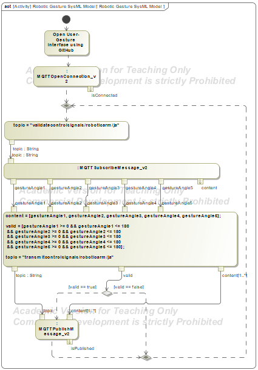

# EECE 5496 Project 4.2 Report: MediaPipe–SysML Integration for Robotic Arm Control

## 1. System Architecture & Setup
The primary objective of this project is to implement a Hardware-in-the-Loop (HIL) and Software-in-the-Loop (SIL) control framework for a 5-Degree-of-Freedom (5-DOF) physical robotic arm using real-time human hand gestures.

The integrated control architecture consists of three core components:
1. **User Interface (MediaPipe Front-End)**: A GitHub-hosted web interface (`Open User-Gesture Interface using GitHub`) captures webcam video input, translates hand keypoints into 5 joint angle values (Base, Shoulder, Elbow, Wrist, and Claw), and publishes them as a 20-byte payload (`<5f` float array) over MQTT.
2. **System of Interest (SysML Activity Model)**: The executable SysML activity diagram functions as middleware. It subscribes to the incoming MQTT topic `validatecontrolsignals/roboticarm/ja`, validates signal parameters, packages valid payloads, and forwards commands to the physical controller.
3. **Robotic Arm Hardware**: Listens to the published MQTT topic `transmitcontrolsignals/roboticarm/ja` to actuate the physical servo motors in real time.

---

## 2. SysML Model Updates & Validation Logic


*Figure 1: SysML Activity Diagram illustrating MQTT connection setup, signal boundary validation, and decision routing logic ([View Diagram File](act_diagram.png)).*

To satisfy the design milestones and protect hardware integrity, the SysML activity model incorporates the following automated validation and safety rules:

* **Interface Launch Action**: Replaces static Colab launcher blocks with an opaque action launching the GitHub-hosted MediaPipe gesture application.
* **Joint Angle Boundary Verification**: Evaluates each incoming signal array to ensure all 5 joint angles satisfy 0° <= v_i <= 180°.
* **Claw/Gripper Overheat Safeguard**: Implements an upper bound check ensuring the claw servo angle **does not exceed 168°**, preventing motor strain and thermal overload.
* **Custom Topic Isolation**: Appends unique student topic suffixes (e.g., `/ja`) to prevent signal overlap across shared MQTT broker channels.
* **Decision Gateway Routing**:
  * **`[valid == true]`**: Data is packed into `content` and published to `transmitcontrolsignals/roboticarm/ja`.
  * **`[valid == false]`**: Execution bypasses publication and loops back to process the next incoming message.

---

## 3. Task 1 Physical Manipulation Trajectory
To demonstrate remote physical manipulation (Milestone 3), the arm executed **Task 1: Slide Object**. The sequence picks up a block at Position O, slides it laterally to Position A, returns to Position O, slides forward to Position B, returns to Position O, and releases at Home.

| Step | Motion Phase | Joint Angles `[Base, Shoulder, Elbow, Wrist, Claw]` | Operational Description |
| :---: | :--- | :---: | :--- |
| **1** | Start at Home | `[122.0, 90.0, 90.0, 90.0, 10.0]` | Baseline neutral position |
| **2** | Approach Object (Pos O) | `[122.0, 100.0, 150.0, 90.0, 10.0]` | Lower arm over object at Pos O |
| **3** | Grip Block | `[122.0, 100.0, 150.0, 90.0, 166.0]` | Close claw at **166°** (<= 168° limit) |
| **4** | Slide to Pos A | `[152.0, 100.0, 150.0, 90.0, 166.0]` | Rotate base to Position A |
| **5** | Slide back to Pos O | `[122.0, 100.0, 150.0, 90.0, 166.0]` | Return object to origin Position O |
| **6** | Slide forward to Pos B | `[92.0, 100.0, 150.0, 90.0, 166.0]` | Rotate base to Position B |
| **7** | Slide back to Pos O | `[122.0, 100.0, 150.0, 90.0, 166.0]` | Return object to Position O |
| **8** | Return Home & Release | `[122.0, 90.0, 90.0, 90.0, 10.0]` | Open claw to release block and park |

---

## 4. Physical Testing & Execution Logs

### Performance Summary
The Hardware-in-the-Loop test confirmed continuous end-to-end signal transmission. Hand gesture commands captured by MediaPipe passed through the SysML validation gateway and successfully actuated the physical arm through all 8 steps without trigger failures or current overruns.

### Terminal Test Execution Log
```
Received: b'\x00\x00\x00\x00ff\xdcB\x00\x00\x00\x00\x00\x00\xb4B\x00\x00\xb4B'
MQTT transmitcontrolsignals/roboticarm/ja →  Arduino: (0.0, 110.19999694824219, 0.0, 90.0, 90.0)
Received: b"\x00\x00\x00\x00ff\xdcB\x00\x00\x00\x00\x00\x00\xb4B\x9a\x19'C"
MQTT transmitcontrolsignals/roboticarm/ja →  Arduino: (0.0, 110.19999694824219, 0.0, 90.0, 167.10000610351562)
Received: b"\xcd\xccHBff\xdcB\x00\x00\x00\x00\x00\x00\xb4B\x9a\x19'C"
MQTT transmitcontrolsignals/roboticarm/ja →  Arduino: (50.20000076293945, 110.19999694824219, 0.0, 90.0, 167.10000610351562)
Received: b"\x00\x00\x00\x00ff\xdcB\x00\x00\x00\x00\x00\x00\xb4B\x9a\x19'C"
MQTT transmitcontrolsignals/roboticarm/ja →  Arduino: (0.0, 110.19999694824219, 0.0, 90.0, 167.10000610351562)
Received: b"\x00\x00\x00\x00ff\xdcB\x00\x00\xf0A\x00\x00\xb4B\x9a\x19'C"
MQTT transmitcontrolsignals/roboticarm/ja →  Arduino: (0.0, 110.19999694824219, 30.0, 90.0, 167.10000610351562)
Received: b"\x00\x00\x00\x00ff\xdcB\x00\x00\x00\x00\x00\x00\xb4B\x9a\x19'C"
MQTT transmitcontrolsignals/roboticarm/ja →  Arduino: (0.0, 110.19999694824219, 0.0, 90.0, 167.10000610351562)
Received: b"\x00\x00\x00\x0033\x84B\x00\x00\x00\x00\x00\x00\xb4B\x9a\x19'C"
MQTT transmitcontrolsignals/roboticarm/ja →  Arduino: (0.0, 66.0999984741211, 0.0, 90.0, 167.10000610351562)
Received: b"\x00\x00\x00\x00ff\xdcB\x00\x00\x00\x00\x00\x00\xb4B\x9a\x19'C"
MQTT transmitcontrolsignals/roboticarm/ja →  Arduino: (0.0, 110.19999694824219, 0.0, 90.0, 167.10000610351562)
Received: b"\x00\x00\x00\x00\x9a\x99MB\x00\x00\x00\x00\x00\x00\xb4B\x9a\x19'C"
MQTT transmitcontrolsignals/roboticarm/ja →  Arduino: (0.0, 51.400001525878906, 0.0, 90.0, 167.10000610351562)
Received: b"\x00\x00\x00\x00\x9a\x99\xddB\x00\x00\x00\x00\x00\x00\xb4B\x9a\x19'C"
MQTT transmitcontrolsignals/roboticarm/ja →  Arduino: (0.0, 110.80000305175781, 0.0, 90.0, 167.10000610351562)
Received: b"\x00\x00\x00\x00\x9a\x19\x11C\x00\x00\x00\x00\x00\x00\xb4B\x9a\x19'C"
MQTT transmitcontrolsignals/roboticarm/ja →  Arduino: (0.0, 145.10000610351562, 0.0, 90.0, 167.10000610351562)
Received: b"\x00\x00\x00\x00\x9a\x99\xddB\x00\x00\x00\x00\x00\x00\xb4B\x9a\x19'C"
MQTT transmitcontrolsignals/roboticarm/ja →  Arduino: (0.0, 110.80000305175781, 0.0, 90.0, 167.10000610351562)
Received: b"\x00\x00\x00\x00\x9a\x99\xddBff0B\x00\x00\xb4B\x9a\x19'C"
MQTT transmitcontrolsignals/roboticarm/ja →  Arduino: (0.0, 110.80000305175781, 44.099998474121094, 90.0, 167.10000610351562)
Received: b"\x00\x00\x00\x00\xcd\xcc\x17Cff0B\x00\x00\xb4B\x9a\x19'C"
MQTT transmitcontrolsignals/roboticarm/ja →  Arduino: (0.0, 151.8000030517578, 44.099998474121094, 90.0, 167.10000610351562)
Received: b"\x00\x00\x00\x00ff\xdcB\x00\x00\x00\x00\x00\x00\xb4B\x9a\x19'C"
MQTT transmitcontrolsignals/roboticarm/ja →  Arduino: (0.0, 110.19999694824219, 0.0, 90.0, 167.10000610351562)
Received: b'\x00\x00\xb4B\x00\x00\xb4B\x00\x00\xb4B\x00\x00\xb4B\x00\x00\xb4B'
MQTT transmitcontrolsignals/roboticarm/ja →  Arduino: (90.0, 90.0, 90.0, 90.0, 90.0)
Received: b'\x00\x00\x00\x00\x9a\x99\xddB\x00\x00\x00\x00\x00\x00\xb4B\x00\x00\xb4B'
MQTT transmitcontrolsignals/roboticarm/ja →  Arduino: (0.0, 110.80000305175781, 0.0, 90.0, 90.0)
Received: b'\x00\x00\x00\x00\x9a\x99\xddB\x00\x00\x00\x00\x00\x00\xb4B\x00\x80&C'
MQTT transmitcontrolsignals/roboticarm/ja →  Arduino: (0.0, 110.80000305175781, 0.0, 90.0, 166.5)
Received: b'\xcd\xccHB\x9a\x99\xddB\x00\x00\x00\x00\x00\x00\xb4B\x00\x80&C'
MQTT transmitcontrolsignals/roboticarm/ja →  Arduino: (50.20000076293945, 110.80000305175781, 0.0, 90.0, 166.5)
Received: b'\x00\x00\x00\x00\x9a\x99\xddB\x00\x00\x00\x00\x00\x00\xb4B\x00\x80&C'
MQTT transmitcontrolsignals/roboticarm/ja →  Arduino: (0.0, 110.80000305175781, 0.0, 90.0, 166.5)
Received: b'\x00\x00\x00\x00\xcd\xcc\x17C\xcd\xcc2B\x00\x00\xb4B\x00\x80&C'
MQTT transmitcontrolsignals/roboticarm/ja →  Arduino: (0.0, 151.8000030517578, 44.70000076293945, 90.0, 166.5)
Received: b'\x00\x00\x00\x00ff\xdcB\x00\x00\x00\x00\x00\x00\xb4B\x00\x80&C'
MQTT transmitcontrolsignals/roboticarm/ja →  Arduino: (0.0, 110.19999694824219, 0.0, 90.0, 166.5)
Received: b'\x00\x00\xb4B\x00\x00\xb4B\x00\x00\xb4B\x00\x00\xb4B\x00\x00\xb4B'
MQTT transmitcontrolsignals/roboticarm/ja →  Arduino: (90.0, 90.0, 90.0, 90.0, 90.0)
```

---

## 5. Conclusion
The integration successfully demonstrated real-time, gesture-based control of a 5-DOF robotic arm through an executable SysML model. The SysML middleware effectively filtered out out-of-bound commands, enforced claw safety limits, and enabled successful completion of Task 1.
